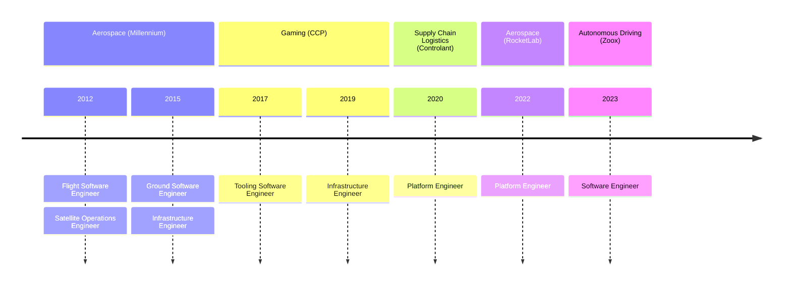

---
# try also 'default' to start simple
theme: purplin
# random image from a curated Unsplash collection by Anthony
# like them? see https://unsplash.com/collections/94734566/slidev
# background: https://cover.sli.dev
background: https://images.unsplash.com/photo-1449247709967-d4461a6a6103?q=80&w=3500&auto=format&fit=crop&ixlib=rb-4.0.3&ixid=M3wxMjA3fDB8MHxwaG90by1wYWdlfHx8fGVufDB8fHx8fA%3D%3D
# some information about your slides, markdown enabled
title: Welcome to Slidev
info: |
  ## Slidev Starter Template
  Presentation slides for developers.

  Learn more at [Sli.dev](https://sli.dev)
# apply any unocss classes to the current slide
class: text-center
# https://sli.dev/custom/highlighters.html
highlighter: shiki
# https://sli.dev/guide/drawing
drawings:
  persist: false
# slide transition: https://sli.dev/guide/animations#slide-transitions
transition: slide-left
# enable MDC Syntax: https://sli.dev/guide/syntax#mdc-syntax
mdc: true
---

# What Feeds Me?

---

# Current Company

Zoox

Autonomous Driving Robotaxi

- Ride Service App
- Purpose-built Bidirectional Vehicle
- Multiple Sensor Types
- Owned by Amazon

---

## Current Position

### Senior Software Engineer at Zoox

### Team: Simulation Team

- Provides sim tooling for internal customers
- Used to validate driving software

### Subteam: Simulation Operations

- Somewhat DevOps-y
- Automation of workflows
- Increase observability
- Drive improvements via metrics

---

## Current Projects

### Simulation Coverage

---

## Past Positions

